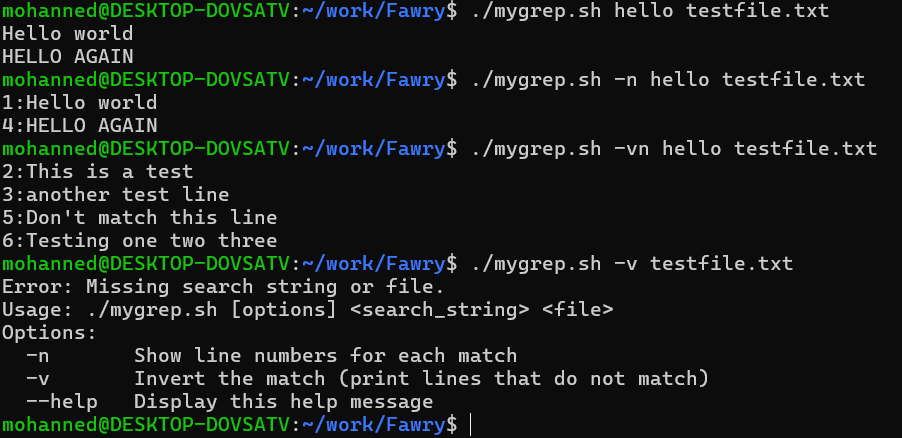

## Reflective Section

### Handling Arguments and Options

- **Usage Information:**  
  The script first checks for the `--help` flag or if no arguments are passed, displaying usage information.

- **Option Parsing:**  
  Options `-n` and `-v` are processed using `getopts`, setting boolean flags accordingly. After parsing, the options are shifted off so that the remaining positional parameters represent the search string and file.

- **Input Validation:**  
  The script validates that both a search string and a file are provided and checks if the file exists.

### Supporting Additional Options (Regex, -i/-c/-l)

- **Regex Support:**  
  To support regex, you could add a flag (e.g., `-E`) and modify the command to use `grep -E` for extended regular expressions.

- **Additional Flags:**  
  For flags like `-i`, `-c`, or `-l`, implement additional conditions in the option parsing logic and append them to the `grep_cmd` variable. The approach is to parse the flags, update the command string accordingly, and then execute the updated command.

### Hardest Part of the Script

Handling combinations of options, such as interpreting combined flags (e.g., `-vn` or `-nv`) using `getopts`, was the most complex aspect. This required careful parsing and thorough testing to ensure all potential combinations were correctly processed.

## Attached is a screenshot of the output for the given testcases

