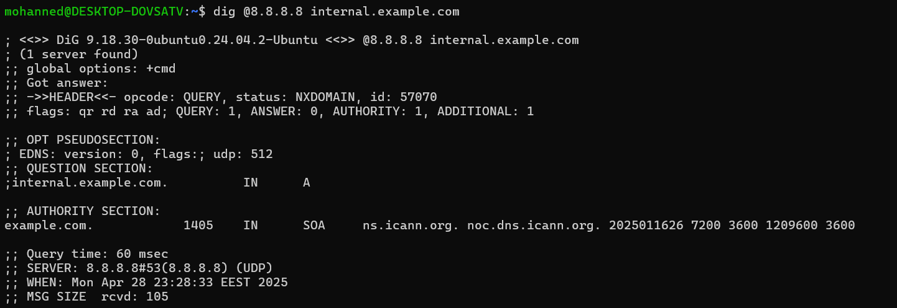

## Current DNS Server Settings


## DNS resolution for internal.example.com using my current DNS


## Test using Google DNS (8.8.8.8)



## The problem
Because both tests return NXDOMAIN, there is no valid DNS record for internal.example.com. This can happen if:

### DNS-related issues:

    * The domain’s DNS records might not have been created or updated.
    * The internal DNS server may be misconfigured.
    * There might be DNS caching issues on client systems.

### Network-related issues:

    * Firewall rules or security groups blocking ports 80/443.
    * Routing problems in the network preventing proper connectivity.
    * VPN or proxy configurations interfering with DNS or service reachability.
  
### Service-related issues:

    * The web service might not be properly bound to the correct IP/port.
    * Load balancer misconfigurations if one is used.
    * Misconfigured SSL or HTTP setups.

### Local system issues:

    * An incorrect or missing entry in the local /etc/hosts file that overrides DNS resolution.
    * Local firewall settings or caching issues.

# Possbile Fixes:

# Troubleshooting DNS, Firewall, Service, and Local Hosts Issues

## 1. DNS Misconfiguration

### Confirm:
- Compare the DNS responses from your **local DNS** and **Google DNS**. If both show `NXDOMAIN` (No such domain), it suggests a DNS issue.
- Double-check the DNS zone records.

### Fix:
If you’re managing DNS, ensure that an **A record** exists for `internal.example.com` and points to the correct IP address:

1. Log into your **DNS management console**.
2. Ensure the **A record** for `internal.example.com` exists and points to the correct IP address.
3. **Propagate the changes** (this may take some time) and test again using `dig`:

```bash
   dig internal.example.com
```

## 2. Local `/etc/hosts` Override (Temporary Workaround)

### Confirm:
- Check your **`/etc/hosts`** file for any conflicting entries that might override DNS resolution:

```bash
  cat /etc/hosts
```

### Fix:
- If you know the correct IP for `internal.example.com`, you can temporarily add it to `/etc/hosts` to bypass DNS resolution:

  Edit `/etc/hosts`:

```bash
  sudo nano /etc/hosts
```

Add a line like:

```plaintext
  192.168.1.1 internal.example.com
```

This will direct any traffic for internal.example.com to 192.168.1.1, bypassing DNS.

## Bonus: Configure Local /etc/hosts Entry & Persist DNS Settings

### A. Bypass DNS Using the /etc/hosts File

1. **Edit the /etc/hosts File**  
   Open a terminal and run:
   ```bash
   sudo nano /etc/hosts
   ```

2. **Add a Local Entry for Testing**  
   At the bottom of the file, add a line with the correct IP address for `internal.example.com`. For example, if the IP is `192.168.1.100`:
   ```plaintext
   192.168.1.100    internal.example.com
   ```

3. **Test the Service**  
   Run:
   ```bash
   curl -v http://internal.example.com
   ```
---

### B. Persist DNS Server Settings

Since `/etc/resolv.conf` may be auto-generated, you can persist custom DNS settings using one of the following methods:

#### Option 1: Using systemd-resolved

1. **Edit the systemd-resolved Configuration**  
   Run:
   ```bash
   sudo nano /etc/systemd/resolved.conf
   ```
2. **Update the [Resolve] Section**  
   Uncomment and add/update the following lines:
   ```ini
   [Resolve]
   DNS=8.8.8.8 8.8.4.4
   FallbackDNS=1.1.1.1 1.0.0.1
   ```
3. **Restart systemd-resolved**  
   Run:
   ```bash
   sudo systemctl restart systemd-resolved
   ```

#### Option 2: Using NetworkManager

1. **List Your Network Connections**  
   Run:
   ```bash
   nmcli con show
   ```
2. **Edit Your Active Connection**  
   Replace `"Your Connection"` with the actual connection name and run:
   ```bash
   nmcli con edit "Your Connection"
   ```
3. **Set Custom DNS in the Editor**  
   In the interactive prompt, enter:
   ```bash
   set ipv4.dns "8.8.8.8 8.8.4.4"
   set ipv4.ignore-auto-dns yes
   save
   quit
   ```
4. **Restart NetworkManager**  
   Run:
   ```bash
   sudo systemctl restart NetworkManager
   ```

These steps ensure that your system uses the specified DNS servers permanently and that you have a local workaround via `/etc/hosts` for testing the connectivity to `internal.example.com`.